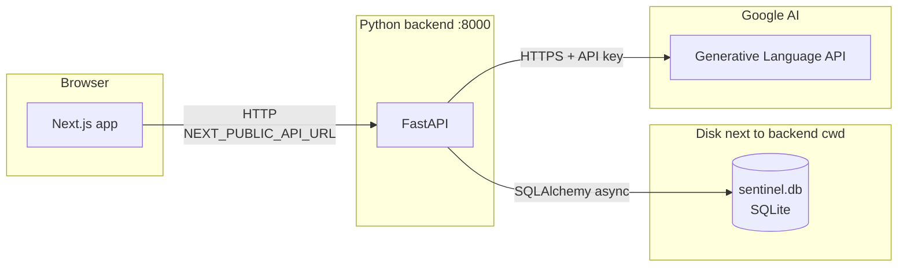

# Sentinel · Enterprise situation room

**Autonomous AI agents** monitor your business data, spot anomalies, reason about root cause, draft actions, and produce an executive briefing. Upload CSV, Excel, PDF, images, JSON, or pasted text and watch the pipeline run end to end.

Built with **Google Gemini** (Flash + Pro). Open source under the MIT license.

---

## The problem

Teams drown in data but miss early signals: support spikes, pipeline slowdowns, churn hints. By the time someone opens a dashboard, the damage is often done.

**Sentinel** ingests operational data, runs four coordinated agents (monitor, analyst, action, briefing), and writes every step to **Agent logs** so the system is inspectable, not a black box.

---

## Gemini API key (choose one)

You need a Gemini API key before uploads work.

| Method | When to use |
|--------|-------------|
| **Settings in the app** | After clone, start backend + frontend, open `/settings`, paste your key, click **Save**. Stored in SQLite (`app_settings`). Overrides `GEMINI_API_KEY` in `.env` when set. |
| **`backend/.env`** | Set `GEMINI_API_KEY` from [Google AI Studio](https://aistudio.google.com/apikey). Best for Docker, CI, or production. |

The Settings API has no login: only use on trusted networks, or add your own auth in front of the API in production.

---

## Demo

> Upload `demo_data/support_tickets.csv` → watch the pipeline run live → see the executive briefing appear in under 60 seconds.

| Page | What you see |
|---|---|
| **Dashboard** | Live stats, anomaly feed, agent activity log — auto-refreshes every 10s |
| **Upload** | Drop any file or paste data — pipeline fires immediately |
| **Agent Logs** | Step-by-step reasoning trace from all 4 agents in real time |
| **Anomalies** | Every detected issue with severity, metric deviation, and description |
| **Actions** | Full content of every email, task, and escalation the agent wrote |
| **Executive Briefing** | Boardroom-ready narrative — what happened, why, what was done |

---

## How It Works — 4-Agent Pipeline

Every upload triggers a sequential, collaborative pipeline. Each agent has a distinct role and model:

```
┌──────────────────────────────────────────────────────────────────────┐
│                         USER INPUT                                   │
│   CSV · Excel · PDF · PNG/JPEG (screenshot) · JSON · pasted text     │
└──────────────────────────────┬───────────────────────────────────────┘
                               │
                               ▼
┌──────────────────────────────────────────────────────────────────────┐
│  1. MONITOR AGENT  ·  Gemini 2.5 Flash                               │
│                                                                      │
│  • Parses any file format (multimodal for images/PDFs)               │
│  • Extracts structured metrics: volume, rates, scores, values        │
│  • Compares each metric against its expected baseline                │
│  • Flags deviations: >15% = medium · >30% = high · >50% = critical   │
│                                                                      │
│  Output → list of anomalies with severity, metric name, deviation %  │
└──────────────────────────────┬───────────────────────────────────────┘
                               │  anomalies detected
                               ▼
┌──────────────────────────────────────────────────────────────────────┐
│  2. ANALYST AGENT  ·  Gemini 2.5 Pro                                 │
│                                                                      │
│  • Runs deep root cause analysis on each anomaly                     │
│  • Cross-correlates with all other metrics in context                │
│  • Assesses business impact and urgency                              │
│  • Identifies recommended owner (VP Sales, CTO, COO …)               │
│  • If multiple anomalies: finds shared root causes across them       │
│                                                                      │
│  Output → root_cause, correlated_metrics, urgency, analysis_summary  │
└──────────────────────────────┬───────────────────────────────────────┘
                               │  analysis complete
                               ▼
┌──────────────────────────────────────────────────────────────────────┐
│  3. ACTION AGENT  ·  Gemini 2.5 Flash                                │
│                                                                      │
│  • Decides what autonomous actions to take (2–3 per anomaly)         │
│  • Drafts full email body + subject for relevant stakeholder         │
│  • Writes clear task descriptions with acceptance criteria           │
│  • Composes executive escalation messages                            │
│  • Writes Slack-style alerts where appropriate                       │
│                                                                      │
│  Output → list of {action_type, title, recipient, full content}      │
└──────────────────────────────┬───────────────────────────────────────┘
                               │  actions logged
                               ▼
┌──────────────────────────────────────────────────────────────────────┐
│  4. BRIEFING AGENT  ·  Gemini 2.5 Pro                                │
│                                                                      │
│  • Synthesises all anomalies and actions into one narrative          │
│  • Writes in the voice of a trusted Chief of Staff                   │
│  • Opens with a clear situation status (calm or urgent)              │
│  • Explains what happened, what the agent did, what needs a decision │
│  • Produces key insights and decisions_needed list                   │
│                                                                      │
│  Output → boardroom-ready briefing (300–400 words)                   │
└──────────────────────────────────────────────────────────────────────┘
```

Every agent step is persisted to the database in real time and streamed to the **Agent Logs** page — you can watch the reasoning happen live.

---

## Supported Input Formats

| Format | How it's processed |
|---|---|
| CSV / Excel | Parsed to DataFrame → passed as structured text |
| PDF | Text extracted page by page via PyPDF2 |
| PNG / JPEG / WebP | Sent directly to Gemini Flash (multimodal) |
| JSON | Pretty-printed and passed as text |
| Plain text / paste | Passed directly |

---

## Tech Stack

| Layer | Technology | Purpose |
|---|---|---|
| **AI: fast tier** | Gemini 2.5 Flash | Monitor Agent, Action Agent (low latency) |
| **AI: reasoning tier** | Gemini 2.5 Pro | Analyst Agent, Briefing Agent (deep reasoning) |
| **Backend** | Python 3.11 + FastAPI | Async REST API, agent orchestration |
| **Scheduler** | APScheduler | Periodic background monitoring jobs |
| **Database** | SQLite + SQLAlchemy (async) | Dev; swap `DATABASE_URL` for PostgreSQL in prod |
| **Frontend** | Next.js 14 (App Router) + Tailwind CSS | Dashboard UI |
| **Containerisation** | Docker + Docker Compose | One-command deployment |

---

## System architecture

At runtime, the **browser** talks only to your **FastAPI** server. The server owns the **SQLite database file** (all app data and optional API key from Settings) and calls the **hosted model API** when agents run.



**Where the database lives (default):** `DATABASE_URL` is `sqlite+aiosqlite:///./sentinel.db`. If you start uvicorn from the `backend/` directory, the file is created as **`backend/sentinel.db`**. It holds normalised tables such as `data_sources`, `anomalies`, `agent_actions`, `executive_briefings`, `agent_logs`, and `app_settings` (runtime API key from the Settings UI).

**Secrets:** `GEMINI_API_KEY` in `backend/.env` is read at process start; a key saved in **Settings** is stored in the `app_settings` row and overrides the env value for Gemini calls until you remove it.

---

## Project Structure

```
sentinel/
│
├── backend/
│   ├── app/
│   │   ├── agents/
│   │   │   ├── monitor_agent.py     # Gemini Flash — metric extraction + anomaly detection
│   │   │   ├── analyst_agent.py     # Gemini Pro  — root cause + cross-correlation
│   │   │   ├── action_agent.py      # Gemini Flash — email/task/escalation drafting
│   │   │   └── briefing_agent.py    # Gemini Pro  — executive narrative generation
│   │   │
│   │   ├── services/
│   │   │   ├── pipeline.py          # Orchestrates all 4 agents in sequence
│   │   │   ├── gemini_service.py    # Flash + Pro wrappers with error handling
│   │   │   ├── gemini_key.py        # DB-backed API key (overrides env when set)
│   │   │   └── logger.py            # Persists agent steps to DB in real time
│   │   │
│   │   ├── routers/
│   │   │   ├── upload.py            # POST /api/upload/file and /api/upload/text
│   │   │   ├── anomalies.py       # GET /api/anomalies and /:id
│   │   │   ├── briefings.py       # GET /api/briefings/latest + POST /generate
│   │   │   ├── dashboard.py       # GET /api/dashboard/stats, /logs, /actions
│   │   │   └── settings.py        # GET/POST/DELETE /api/settings/gemini
│   │   │
│   │   ├── models/
│   │   │   ├── db_models.py         # SQLAlchemy ORM: DataSource, Anomaly, AgentAction …
│   │   │   └── schemas.py           # Pydantic response schemas
│   │   │
│   │   ├── database/
│   │   │   └── connection.py        # Async engine, session factory, init_db()
│   │   │
│   │   ├── config.py                # Pydantic settings — env vars with defaults
│   │   └── main.py                  # FastAPI app, CORS, lifespan, router registration
│   │
│   ├── requirements.txt
│   ├── Dockerfile
│   └── .env.example
│
├── frontend/
│   ├── app/
│   │   ├── page.tsx                 # Marketing landing
│   │   ├── dashboard/page.tsx       # Situation room (stats, feed, activity)
│   │   ├── settings/page.tsx        # Gemini API key (saved to backend SQLite)
│   │   ├── anomalies/page.tsx       # Anomaly list with severity filter
│   │   ├── actions/page.tsx         # Autonomous actions with expand
│   │   ├── briefing/page.tsx        # Executive briefing + generate
│   │   ├── upload/page.tsx          # File upload + paste data
│   │   └── logs/page.tsx            # Agent reasoning trace (5s refresh)
│   │
│   ├── public/
│   │   └── sentinel-logo.png        # Brand mark (replace with your own if needed)
│   ├── components/
│   │   ├── Sidebar.tsx              # Navigation sidebar
│   │   ├── SeverityBadge.tsx        # Colour-coded severity pill
│   │   └── ui/                      # LoadingState, EmptyState, ErrorBanner
│   │
│   ├── lib/
│   │   └── api.ts                   # Typed API client for all backend endpoints
│   │
│   ├── Dockerfile
│   └── .env.local.example
│
├── demo_data/
│   ├── support_tickets.csv          # 15-day support data with realistic spike
│   └── sales_pipeline.csv           # 10-week sales data with pipeline collapse
│
├── docker-compose.yml
└── README.md
```

---

## Environment Variables

### Backend (`backend/.env`)

| Variable | Default | Description |
|---|---|---|
| `GEMINI_API_KEY` | *(optional if you use Settings UI)* | From [Google AI Studio](https://aistudio.google.com/apikey). Used when no key is saved in the database. |
| `DATABASE_URL` | `sqlite+aiosqlite:///./sentinel.db` | SQLite for dev; use `postgresql+asyncpg://...` for prod |
| `GEMINI_FLASH_MODEL` | `gemini-2.5-flash` | Model for Monitor + Action agents. Fallback: `gemini-1.5-flash` |
| `GEMINI_PRO_MODEL` | `gemini-2.5-pro` | Model for Analyst + Briefing agents. Fallback: `gemini-1.5-pro` |
| `FRONTEND_URL` | `http://localhost:3000` | Allowed CORS origin |
| `ENVIRONMENT` | `development` | `development` or `production` |
| `MONITOR_INTERVAL_SECONDS` | `60` | How often the scheduler re-checks data sources |

### Frontend (`frontend/.env.local`)

| Variable | Default | Description |
|---|---|---|
| `NEXT_PUBLIC_API_URL` | `http://localhost:8000` | Backend API base URL |

---

## Quick Start

### Prerequisites

- Python 3.11+
- Node.js 20+
- A free [Gemini API key](https://aistudio.google.com) (takes 2 minutes, no billing required)

### Option A — Local development (recommended for first run)

**1. Clone the repo**
```bash
git clone https://github.com/<your-username>/sentinel.git
cd sentinel
```

**1b. Backend env file**
```bash
cp backend/.env.example backend/.env
```

**2. Configure Gemini (pick one path)**

- **Path A (UI):** start the backend and frontend (steps 3–4), then open `http://localhost:3000/settings`, paste your API key, and save.
- **Path B (env):** put your key in `backend/.env` as `GEMINI_API_KEY=your_key_here` (file created in step 1b).

**3. Frontend env (optional)**

```bash
cp frontend/.env.local.example frontend/.env.local
# NEXT_PUBLIC_API_URL=http://localhost:8000 is the default
```

**4. Start the backend**
```bash
cd backend
python -m venv venv
source venv/bin/activate          # Windows: venv\Scripts\activate
pip install -r requirements.txt
uvicorn app.main:app --reload
# → API running at http://localhost:8000
# → Interactive docs at http://localhost:8000/docs
```

**5. Start the frontend** (new terminal)
```bash
cd frontend
npm install
npm run dev
# → Dashboard at http://localhost:3000
```

**6. Try it**
- Go to `http://localhost:3000/upload`
- Upload `demo_data/support_tickets.csv`, name it "Q2 Support Data"
- Switch to the **Agent Logs** tab and watch the pipeline run live

---

### Option B — Docker Compose

```bash
cp backend/.env.example backend/.env
# Set GEMINI_API_KEY here, or leave blank and use http://localhost:3000/settings after startup.

docker compose up --build
```

| Service | URL |
|---|---|
| Frontend | http://localhost:3000 |
| Backend API | http://localhost:8000 |
| API Docs (Swagger) | http://localhost:8000/docs |

---

## API Reference

All endpoints return JSON. Interactive docs available at `/docs`.

### Upload

| Method | Endpoint | Body | Description |
|---|---|---|---|
| `POST` | `/api/upload/file` | `multipart/form-data`: `file`, `source_name`, `source_type` | Upload any file and trigger the full 4-agent pipeline |
| `POST` | `/api/upload/text` | `{ text, source_name, source_type }` | Paste raw text and trigger the pipeline |

### Dashboard

| Method | Endpoint | Description |
|---|---|---|
| `GET` | `/api/dashboard/stats` | Counts + recent anomalies, actions, and agent logs in one call |
| `GET` | `/api/dashboard/logs` | Latest 50 agent reasoning steps |
| `GET` | `/api/dashboard/actions` | Latest 50 autonomous actions |

### Anomalies

| Method | Endpoint | Query params | Description |
|---|---|---|---|
| `GET` | `/api/anomalies` | `severity`, `source_type`, `limit` | List all anomalies |
| `GET` | `/api/anomalies/{id}` | — | Single anomaly detail |
| `GET` | `/api/anomalies/{id}/actions` | — | Actions generated for a specific anomaly |

### Briefings

| Method | Endpoint | Description |
|---|---|---|
| `GET` | `/api/briefings` | List all briefings (newest first) |
| `GET` | `/api/briefings/latest` | Most recent briefing, or `null` if none |
| `POST` | `/api/briefings/generate` | Generate a new briefing from today's data right now |

### Settings (Gemini key)

| Method | Endpoint | Body | Description |
|---|---|---|---|
| `GET` | `/api/settings/gemini` | — | Returns `{ configured, source }` where `source` is `database`, `environment`, or `none`. Never returns the key. |
| `POST` | `/api/settings/gemini` | `{ "api_key": "..." }` | Save key to SQLite and reconfigure Gemini. |
| `DELETE` | `/api/settings/gemini` | — | Remove stored key; falls back to `GEMINI_API_KEY` if set. Returns 400 if nothing is left to use. |

---

## Demo Walkthrough

### Scenario 1: Support ticket spike
1. Upload `demo_data/support_tickets.csv` (15 days of support data)
2. The Monitor Agent detects: ticket volume +120%, CSAT -44%, resolution time +312%
3. The Analyst Agent diagnoses: "Spike correlates with product update on April 23 — likely a regression causing repeat contacts"
4. The Action Agent drafts: escalation to VP Support, engineering task for regression triage, customer communication
5. The Briefing Agent writes the executive summary

### Scenario 2: Sales pipeline collapse
1. Upload `demo_data/sales_pipeline.csv` (10 weeks of sales data)
2. Monitor Agent detects: win rate dropped from 81% → 17%, deal velocity slowed from 31 → 74 days
3. Analyst Agent: "14 enterprise deals stalled in legal review — systematic blocker, not performance issue"
4. Action Agent: escalation to CRO + proposal for dedicated legal resources
5. Briefing Agent: board-level narrative with recommended decisions

### Scenario 3: Dashboard screenshot (multimodal)
1. Take a screenshot of any Salesforce / HubSpot / Looker dashboard
2. Upload as PNG to Sentinel
3. Gemini Flash reads the image directly — no OCR needed — and extracts visible KPIs
4. Same pipeline fires as with structured data

---

## Design notes

Multi-agent pipeline (monitor to briefing), structured logging, multimodal inputs (PDF, images), and SQLite for easy local runs. Swap `DATABASE_URL` for Postgres when you scale out.

---

## Gemini API Usage

| Agent | Model | Why |
|---|---|---|
| Monitor Agent | `gemini-2.5-flash` | High-frequency metric extraction needs low latency |
| Action Agent | `gemini-2.5-flash` | Action drafting is straightforward; speed matters |
| Analyst Agent | `gemini-2.5-pro` | Root cause reasoning benefits from deeper thinking |
| Briefing Agent | `gemini-2.5-pro` | Long-form executive prose requires strong instruction following |

> **Free tier is sufficient for demos.** If you hit a `429` rate limit, set `GEMINI_FLASH_MODEL=gemini-1.5-flash` and `GEMINI_PRO_MODEL=gemini-1.5-pro` in your `.env` as both are free tier.

---

## Deployment

### Backend → Railway

This repo’s **GitHub root** is the monorepo folder (`README.md` + `sentinel/`), not `sentinel/backend` alone. Railpack only sees Python if it builds the right tree.

**Option A (simplest):** Leave **Root Directory** empty (repo root). A **`Dockerfile`** at the repo root builds `sentinel/backend` and listens on Railway’s **`PORT`**.

**Option B:** In the Railway service → **Settings** → **Root Directory**, set **`sentinel/backend`**. Then Railpack sees `requirements.txt` and can use native Python detection (or the `Dockerfile` inside that folder).

Then add variables (at minimum **`GEMINI_API_KEY`**, **`FRONTEND_URL`** for CORS, and for production **`DATABASE_URL`** to a Railway Postgres plugin instead of SQLite).

### Frontend → Vercel

```bash
# 1. Import GitHub repo on vercel.com
# 2. Set root directory to sentinel/frontend
# 3. Add NEXT_PUBLIC_API_URL=https://your-railway-backend-url.railway.app
# 4. Deploy
```

---

## License

MIT. See [LICENSE](LICENSE).

---

## Contributing

Issues and pull requests are welcome. Please keep secrets out of git (use `.env` and the in-app Settings page for local keys).
